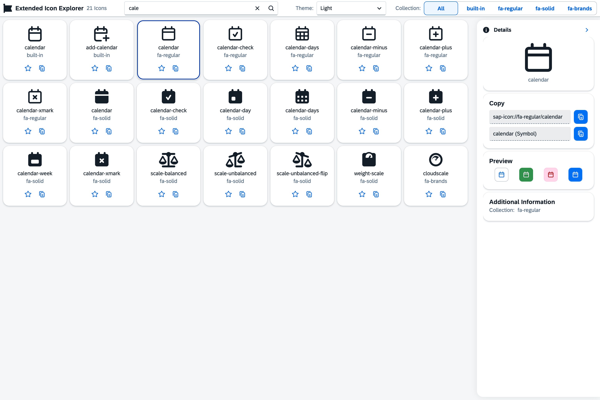

# 🎨 UI5 Icon Explorer

> A powerful and modern icon explorer for SAPUI5 applications that extends the [ui5-icon-explorer](https://github.com/mariokernich/ui5-icon-explorer) with Font Awesome icons together with the built-in icons with the look and feel of the standard UI5 icon explorer of https://sapui5.hana.ondemand.com/sdk/iconExplorer.html.

## ✨ Features

- 🔍 **Smart Search** - Find icons by name with instant results
- 📋 **One-Click Copy** - Copy icon codes directly to clipboard
- ⭐ **Favorites System** - Mark and organize your favorite icons
- 🎨 **Theme Switching** - Toggle between light and dark themes
- 📚 **Collection Filtering** - Filter by specific icon collections
- 🔍 **Detailed View** - Comprehensive icon information and usage examples
- 📱 **Responsive Design** - Works seamlessly on desktop and mobile devices

## 🚀 Live Demo

**[Try it online →](https://ie.kernich.de)**

### Available Scripts

| Command              | Description                                                    |
| -------------------- | -------------------------------------------------------------- |
| `npm start`          | Start development server  |
| `npm run build`      | Build the app for production                               |
| `npm run check:ts`   | TypeScript type checking                                       |
| `npm run check:lint` | ESLint code quality check                                      |
| `npm run check:ui5`  | ui5lint check                                                  |
| `npm run check:all`  | Run all code quality checks                                    |
| `npm run fix:lint`   | Automatically fix lint issues if possible                      |

## 🤝 Contributing

We welcome contributions! Please feel free to submit issues and pull requests.

### Development Workflow

1. Fork the repository
2. Create a feature branch (`git checkout -b feature/amazing-feature`)
3. Commit your changes (`git commit -m 'Add amazing feature'`)
4. Push to the branch (`git push origin feature/amazing-feature`)
5. Open a Pull Request

## 📄 License

This project is licensed under the Apache License 2.0 - see the [LICENSE](LICENSE) file for details.

## ⭐ Support

If you find this library helpful, please consider giving it a star on GitHub! ⭐

---

**Made with ❤️ for the SAP UI5 community**